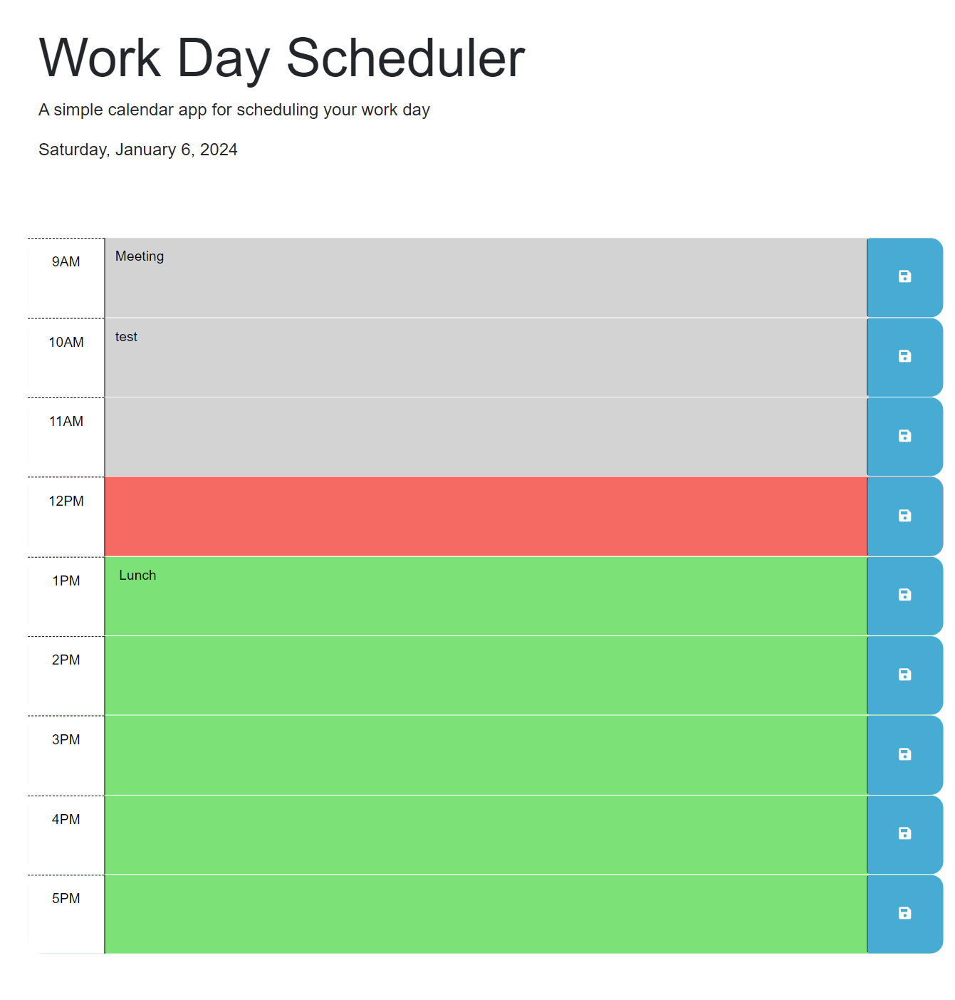

# Bootcamp Challenge Week Five - Thirdparty APIs Work Day scheduler

## Description

Purpose: to test my knowledge of thirdparty APIs.

In this project i was given starter code including the html and css but no javascript. The task was to create javascript that dynamically changes its appearance based on the time of day while also saving items to local storage

During this project I learnt the power of jQueary and traversing the DOM.

## User Story

```
AS AN employee with a busy schedule
I WANT to add important events to a daily planner
SO THAT I can manage my time effectively
```

## Acceptance Criteria

```
GIVEN I am using a daily planner to create a schedule
WHEN I open the planner
THEN the current day is displayed at the top of the calendar
WHEN I scroll down
THEN I am presented with time blocks for standard business hours of 9am to 5pm
WHEN I view the time blocks for that day
THEN each time block is color-coded to indicate whether it is in the past, present, or future
WHEN I click into a time block
THEN I can enter an event
WHEN I click the save button for that time block
THEN the text for that event is saved in local storage
WHEN I refresh the page
THEN the saved events persist
```

## Usage

The completed project can be viewed via GitHub pages as below.
https://mlewis89.github.io/wk5-3rdPartyAPIs-WorkDayScheduler

GitHub repository
https://github.com/mlewis89/wk5-3rdPartyAPIs-WorkDayScheduler

## Screen Shots of Completed Challenge




## Installation

The project files are within the /root folder of this repo, please explore index.html, highscores.html, ./asests/style.css. , ./assets/js/script.js 


## Credits

Monash University Full Stack Coding bootcamp

## License

Please see MIT Licence within repo

---
